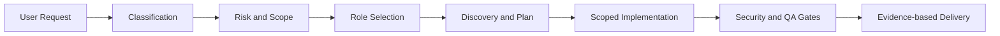

# AI Development Team Playbook

개발 요청을 분류하고 필요한 AI 역할만 선발해 기획, 구현, 보안 검토, 테스트, 최종 보고까지 연결하는 개발팀 운영 플레이북입니다.

## What I Built / 만든 것

AI 에이전트를 역할 이름만 붙여 호출하는 방식이 아니라, 실제 개발 작업에서 책임과 인수인계 기준을 적용할 수 있도록 PM 중심 운영 구조를 만들었습니다. 공통 규칙은 `AGENTS.md`, 역할별 실행 기준은 `agents/`, 적용 예시와 위임 형식은 `docs/`와 `examples/`에 분리했습니다.

## Team Model / 팀 구성

```text
PM / Team Lead
├── Planner
├── Software Architect
├── Frontend Developer
├── Backend Developer
├── Database Engineer
├── AI Engineer
├── Server Engineer
├── DevOps Engineer
├── Security Engineer
└── QA Engineer
```

## Workflow / 작업 흐름



1. 요청을 `Bugfix`, `Feature`, `UI`, `API`, `Data`, `AI`, `Infra`, `Security` 등으로 분류합니다.
2. 변경 범위와 위험도를 `Tiny`부터 `Incident`까지 판단합니다.
3. 변경 신호에 맞는 역할만 선택합니다.
4. 기존 코드 구조와 실행·검증 명령을 먼저 확인합니다.
5. 독립 작업만 위임하고 수정 파일의 소유권을 분리합니다.
6. PM이 결과를 통합한 뒤 보안·데이터·AI·QA 게이트를 적용합니다.
7. 변경 내용, 실행한 검증, 미검증 영역, 남은 위험을 보고합니다.

## Role Selection / 역할 선발

| 변경 신호 | 적용 역할 |
| --- | --- |
| 화면, 컴포넌트, CSS, 접근성 | Frontend, QA |
| API, route, validation | Backend, QA |
| schema, migration, query | Database, Backend, QA |
| 인증, 권한, token, secret | Security, 관련 개발자, QA |
| LLM, prompt, RAG, embedding | AI, Backend, Security, QA |
| Docker, CI/CD, deployment | DevOps, Security, QA |
| 큰 신규 기능 | Planner, Architect, 관련 개발자, Security, QA |

## Development Rules / 운영 규칙

- 모든 역할을 항상 투입하지 않고 범위와 위험도에 맞춰 선택합니다.
- 같은 파일을 여러 작업자가 동시에 수정하지 않도록 책임 범위를 지정합니다.
- 기존 코드베이스의 구조와 패턴을 역할별 일반 지침보다 우선합니다.
- destructive migration, 대량 데이터 변경, secret 변경은 별도 승인 대상으로 다룹니다.
- AI 출력은 구조화, 파싱 실패, 개인정보, prompt injection, human approval 관점에서 검토합니다.
- Acceptance Criteria와 실제 테스트 명령을 연결해 완료 근거를 남깁니다.

## Repository Structure / 저장소 구조

```text
.
├── AGENTS.md
├── agents/
│   ├── pm.md
│   ├── planner.md
│   ├── architect.md
│   ├── frontend.md
│   ├── backend.md
│   ├── database.md
│   ├── ai.md
│   ├── server.md
│   ├── devops.md
│   ├── security.md
│   └── qa.md
├── docs/
│   ├── operating-model.md
│   └── case-study.md
├── examples/delegation-brief.md
└── scripts/validate.sh
```

각 역할 문서는 `Mission`, `Start Checklist`, `Operating Rules`, `Done Checklist`, `Handoff Format`을 공통 구조로 사용합니다.

## Validation / 검증

```bash
bash scripts/validate.sh
```

검증 스크립트는 필수 파일, 역할 문서 구조, 링크 대상, 운영 문서 구성을 확인하며 GitHub Actions에서도 실행됩니다.

## License

MIT License
