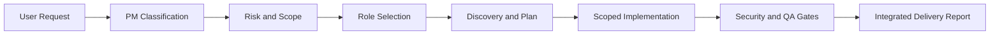

# AI Development Team Playbook

개발 요청을 실제 회사의 팀 운영 방식처럼 분류하고, 필요한 AI 역할만 선발해 구현과 검증까지 연결하는 멀티 에이전트 운영 포트폴리오입니다.

This repository demonstrates a practical operating model for an AI-assisted software team. It focuses on role selection, scoped delegation, parallel execution, security gates, QA, and evidence-based delivery.

## Portfolio Highlights / 포트폴리오 핵심

- 요청을 `Feature`, `Bugfix`, `UI`, `API`, `Data`, `AI`, `Infra`, `Security` 등으로 분류
- 작업 규모와 위험도에 따라 필요한 역할만 자동 선발
- 동일 파일 충돌을 방지하는 병렬 작업 규칙
- 보안, 데이터 변경, AI 기능에 대한 전문 품질 게이트
- Acceptance Criteria와 검증 결과를 연결하는 완료 보고
- 프로젝트별 `AGENTS.md` 오버라이드 지원

## Team Structure / 팀 구성

```text
PM / Team Lead
├── Planner
├── Software Architect
├── Frontend Developer
├── Backend Developer
├── Database Engineer
├── AI Engineer
├── Server Engineer
├── DevOps Engineer
├── Security Engineer
└── QA Engineer
```

각 역할은 [`agents/`](agents/)에 Mission, Start Checklist, Operating Rules, Done Checklist, Handoff Format으로 정의되어 있습니다.

## How It Works / 운영 방식



1. PM이 목표, 범위, 성공 조건을 정리합니다.
2. 변경 신호에 따라 필요한 역할만 선택합니다.
3. 코드베이스 구조와 검증 명령을 먼저 확인합니다.
4. 독립 작업만 병렬로 위임하고 파일 소유권을 분리합니다.
5. PM이 결과를 통합 검토하고 품질 게이트를 실행합니다.
6. 변경, 검증, 미검증 영역, 남은 위험을 보고합니다.

## Automatic Role Selection / 자동 역할 선발

| Change signal | Roles |
|---|---|
| UI, component, CSS, accessibility | Frontend, QA |
| API, route, validation | Backend, QA |
| Schema, migration, query | Database, Backend, QA |
| Auth, permission, token, secret | Security, relevant developer, QA |
| LLM, prompt, RAG, embedding | AI, Backend, Security, QA |
| Docker, CI/CD, deployment | DevOps, Security, QA |
| Large feature | Planner, Architect, relevant developers, Security, QA |

자세한 흐름은 [`docs/operating-model.md`](docs/operating-model.md), 실제 적용 예시는 [`docs/case-study.md`](docs/case-study.md)를 참고합니다.

## Parallel Work Rules / 병렬 작업 규칙

- PM의 즉시 다음 결정을 막는 핵심 작업은 직접 처리합니다.
- 서로 독립적인 조사, 구현, 리뷰만 병렬화합니다.
- 같은 파일을 여러 역할이 동시에 수정하지 않습니다.
- 구현 담당자에게 허용 파일과 금지 파일을 명시합니다.
- Security와 QA 결과는 PM이 최종 구현과 대조합니다.

위임 템플릿은 [`examples/delegation-brief.md`](examples/delegation-brief.md)에 있습니다.

## Repository Structure / 저장소 구조

```text
.
├── AGENTS.md                 # reusable team operating rules
├── agents/                   # role-specific playbooks
├── docs/
│   ├── operating-model.md    # lifecycle and quality gates
│   └── case-study.md         # applied project example
├── examples/
│   └── delegation-brief.md   # scoped agent handoff examples
└── scripts/
    └── validate.sh           # repository structure checks
```

## Validation / 검증

```bash
bash scripts/validate.sh
```

GitHub Actions에서도 같은 검증을 실행합니다.

## Design Principles / 설계 원칙

- 필요한 역할만 투입합니다.
- 기존 코드베이스의 패턴을 우선합니다.
- 큰 변경을 작고 검증 가능한 단위로 나눕니다.
- 보안, 데이터 손실, 운영 위험을 숨기지 않습니다.
- AI의 결과를 그대로 신뢰하지 않고 테스트와 통합 리뷰로 확인합니다.

## License / 라이선스

MIT License
